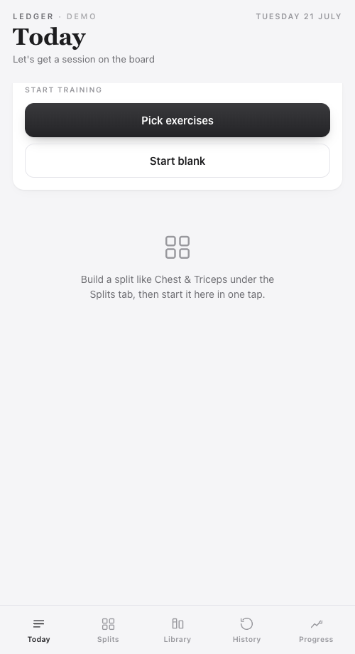
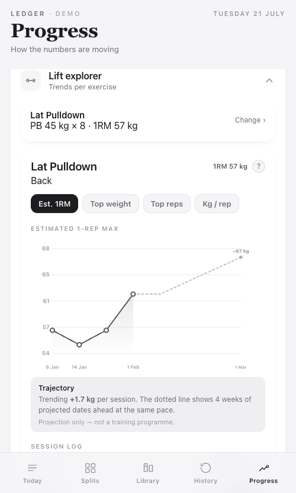

# Stelm

A minimalist strength-training tracker. Log sessions, track personal bests, and see trends per lift- installable as a home-screen app, no account, no backend.

**[Live demo →](https://liamdavis-app.github.io/ledger/)** *(pre-loaded with sample training data, not real logs)*

 

## What it does

- **Today** — start a session from a saved split or from scratch, log sets against a live target, mark them done.
- **Splits** — group exercises into repeatable training days (Push, Legs, Back & Biceps, etc).
- **Library** — the exercise catalogue, with a description field and automatic muscle-group suggestion for new entries.
- **History** — every past session, editable.
- **Progress** — the main analytics surface:
  - **Lift explorer**: per-exercise trend chart (estimated 1RM, top weight, or kg/rep) with a linear projection of where you're headed. Kg/rep can be smoothed to a trailing 3-session average, so one off day doesn't read as a trend — the raw sessions stay visible underneath.
  - **Personal bests**: heaviest weight lifted for 2+ reps, per exercise
  - **Muscle group balance**: set distribution across the week/month
  - **Training frequency heatmap**
  - **Weekly report card**: what improved and what slipped, split- and exercise-level
  - **Body weight**: log weigh-ins with date and time, then read them as a 3-day, 7-day, 2-week or 4-week rolling average with a kg/week trend rate and an optional goal — averaging is the point, since daily swings from food, water and time of day drown out the actual direction
- **Settings** — profile placeholder, default set count, body-weight visibility and goal, and JSON export/import. Importing merges rather than overwrites, so restoring an older backup can't silently drop data the file predates.

## How it's built

- **Single HTML file.** No framework, no bundler, no build step — `index.html` is the entire app.
- **No backend.** All data lives in the browser's `localStorage`, keyed to the URL it's opened from.
- **Installable PWA.** Add to home screen on iOS/Android and it behaves like a native app, including a custom animated splash screen.
- **Hosted on Netlify** (drag-and-drop deploy for my real, private instance). This repo's `/docs` folder is a separate build with fabricated sample data, served via GitHub Pages for the public demo above — my actual training history never leaves my phone.

## Why single-file, no framework

It's a personal tool I use every session, so the priority was zero build-tooling overhead and being able to open one file and understand the whole app end to end — not scalability or team handoff. That trade-off wouldn't hold for a multi-developer product, but for a solo daily-use tool it keeps iteration fast.
